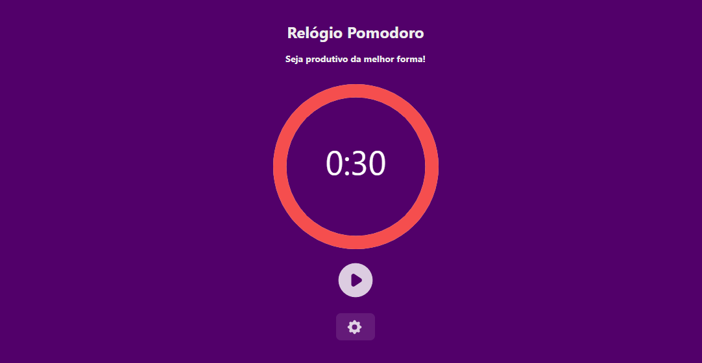

 
 
 
 

  <a href="https://github.com/eduardabrotto">
   <h3> Projeto realizado por Eduarda Brotto </h3>
  </a>
 
### 🛠 Tecnologias

As seguintes ferramentas foram usadas na construção do projeto:

- [React](https://pt-br.reactjs.org/)
- [JavaScript](https://www.javascript.com/)
- [CSS](https://developer.mozilla.org/pt-BR/docs/Web/CSS)

</a>

   [© CopyRight](https://github.com/eduardabrotto/timerapp/blob/7eeb0925f42e74df04c15ca0aea4af97e39ff1c9/LICENSE)
  
  
### 💻 [Deploy da aplicação](https://pomodorodavila.netlify.app/)

